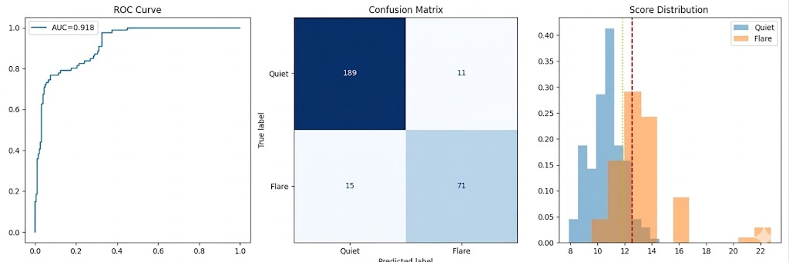

# Solar Flare Detection with a Spatio-Temporal VAE

Detecting rare solar flares from NASA SDO/AIA extreme-ultraviolet image
sequences, using a hybrid **ConvLSTM + Variational Autoencoder** with spatial
and temporal attention.

> Final-year B.Eng. project — Computer Engineering, University of Balamand.

---

## Overview

Solar flares are sudden, intense bursts of radiation that can disrupt
satellites, navigation, communications, and power grids. They are also **rare**,
which makes them hard to model with an ordinary supervised classifier, so a model
can score deceptively well just by always predicting "quiet."

This project reframes flare detection as **anomaly detection**. A variational
autoencoder learns what the *normal, quiet Sun* looks like over a short time
window. Sequences that the model reconstructs poorly, or that land far from the
learned "normal" region of latent space, are flagged as candidate flares. A
small supervised head and a learned fusion block then sharpen that signal into a
single flare score.

## Approach

The model takes a sequence of **10 consecutive multi-channel frames**
(~1 hour at a 6-minute cadence, four SDO/AIA wavelengths) and combines:

- **Spatial attention** — learns *where* in each frame to focus (active regions).
- **ConvLSTM encoder** — models *how* those regions evolve across the sequence.
- **Temporal attention** — weights the most informative frames in the window.
- **Variational latent space** — a compact representation of the normal Sun.
- **Regulator fusion block** — combines three complementary signals into one
  flare score:
  1. **reconstruction error** — how poorly the VAE reproduces the input,
  2. **latent Mahalanobis distance** — how far the sequence sits from the
     normal-Sun distribution,
  3. a **supervised classifier probability**.

## Results

The metrics below were measured under the project's original evaluation
configuration, in which every flare event was used in **both** the calibration
and the evaluation stage. They are therefore best read as an **optimistic upper
bound** on performance rather than a strict held-out result.

The code in this repository implements the stricter train / validation / test
split described under [Method details](#method-details), which removes that
overlap; re-running it yields more conservative held-out figures on the
threshold-dependent metrics (precision, recall, F1, accuracy). Ranking
performance (ROC-AUC) is driven mainly by the unsupervised reconstruction and
latent-distance signals, learned only from quiet-Sun data, never from flares, 
and so is expected to be the most robust of the numbers below.

| Metric      | Score |
|-------------|:-----:|
| ROC-AUC     | 0.918 |
| Precision   | 0.866 |
| Recall      | 0.826 |
| F1-score    | 0.845 |
| Accuracy    | 0.909 |

**Confusion matrix**

|                  | Predicted Quiet | Predicted Flare |
|------------------|:---------------:|:---------------:|
| **Actual Quiet** |   189 (TN)      |    11 (FP)      |
| **Actual Flare** |    15 (FN)      |    71 (TP)      |

ROC-AUC is the headline metric because it is threshold-free and robust to the
heavy class imbalance between quiet and flare sequences.



*ROC curve, confusion matrix, and the distribution of flare scores for quiet vs.
flare sequences (with the detection threshold and a 2-sigma early-warning line).*

## Repository structure

```
solar_flare_vae.py          # model, training, calibration, evaluation pipeline
README.md
.gitignore
performance_summary.png      # ROC + confusion matrix + score distribution
flare_class_separation.png   # score distribution by flare class (Quiet / M / X)
anomaly_heatmap_flare_*.png  # per-frame reconstruction-error heatmaps
```

## Data

The NASA SDO/AIA imagery is **not included** in this repository — it is large
and is distributed by NASA, not by this project. Such data is publicly available
from NASA's Solar Dynamics Observatory archive (e.g. JSOC or Helioviewer).

The code expects:

- a **labels CSV** with columns:
  - `dir` — path to a folder of frames,
  - `timestamp` — capture time of that frame,
  - `label` — `1` = flare, `0` = quiet, `-1` = unusable/excluded,
  - `flare_type` — e.g. `M`, `X` (blank for quiet);
- **one folder per timestamp**, each containing one `.npy` file per channel:
  `94A.npy`, `131A.npy`, `171A.npy`, `193A.npy`.

## Installation

```bash
pip install torch numpy pandas opencv-python scikit-learn matplotlib tqdm
```

A CUDA-capable GPU is recommended for training but not required as the code falls
back to CPU automatically (mixed precision is used only on GPU).

## Usage

Train the VAE backbone from scratch and run the full pipeline:

```bash
python solar_flare_vae.py --csv labels.csv --data-dir ./data --train
```

Reuse previously saved weights and skip backbone training:

```bash
python solar_flare_vae.py --csv labels.csv --data-dir ./data
```

`--data-dir` lets the dataset find frame folders by name, so the project runs on
any machine regardless of the absolute paths stored in the CSV.

## Method details

The pipeline runs in five stages, each on a **disjoint data split**:

1. **Backbone training** — unsupervised VAE training on quiet sequences only
   (reconstruction loss + KL divergence).
2. **Normal-Sun modelling** — latent mean/covariance and per-signal scales
   estimated from quiet data, used for the Mahalanobis distance and to
   standardise the fusion signals.
3. **Head calibration** — supervised fine-tuning of *only* the classifier and
   Regulator heads (the VAE backbone stays frozen), with a class-balanced
   sampler to counter flare rarity.
4. **Threshold selection** — the operating threshold is chosen on a validation
   split, then applied unchanged to the test set.
5. **Evaluation** — final metrics computed on the held-out test split.

Quiet sequences (abundant) are split 70/15/15 train/validation/test. The much
rarer flare sequences are split across calibration / validation / test so that
no flare used for training is reused for evaluation.

## Limitations & future work

- **Evaluation overlap.** The reported numbers were measured under a setup where
  flare events appeared in both the calibration and the evaluation stage (see
  [Results](#results)), so they are an optimistic estimate. The stricter split in
  the provided code produces more conservative held-out figures.
- **Flare scarcity.** Flares are rare, so the validation and test flare sets are
  small. Metrics should be read alongside the threshold-free ROC-AUC, and
  repeated runs or k-fold cross-validation would tighten the estimates.
- **Detection vs. forecasting.** The current model flags flare-associated
  anomalies *within* an observation window. Extending it to genuine
  ahead-of-time forecasting (predicting flares before onset) is the natural next
  step.
- **Scope.** Fixed 6-minute cadence and four channels; adding more wavelengths,
  longer windows, and calibrated probability outputs are promising extensions.

## Acknowledgements

Final-year Computer Engineering project at the University of Balamand. Built with
PyTorch. Solar imagery courtesy of NASA's Solar Dynamics Observatory (SDO/AIA).

**Author:** Gio Saliba · [LinkedIn](https://www.linkedin.com/in/gio-saliba-5583ab261/)
